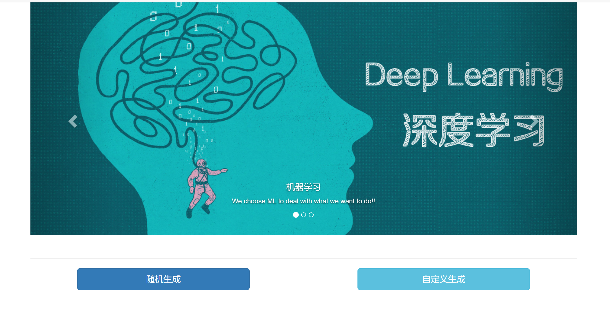
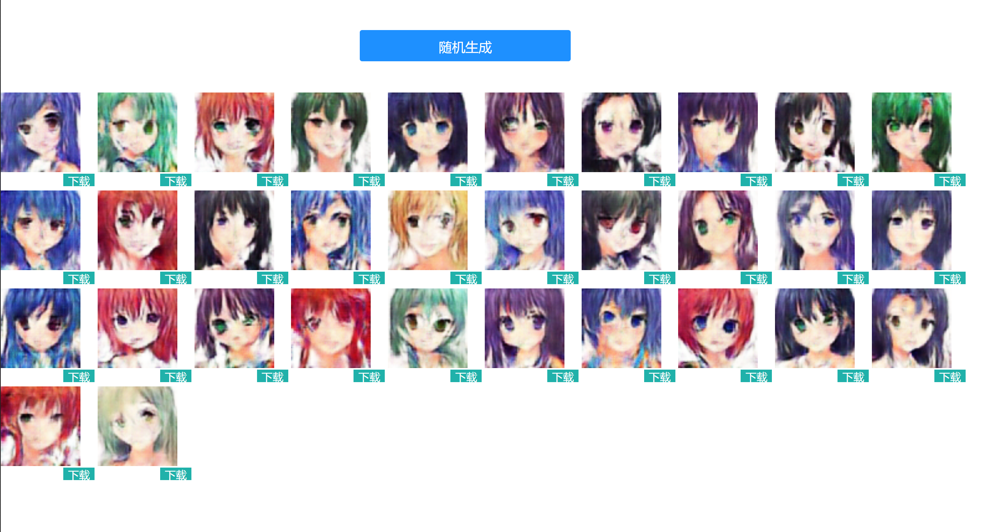
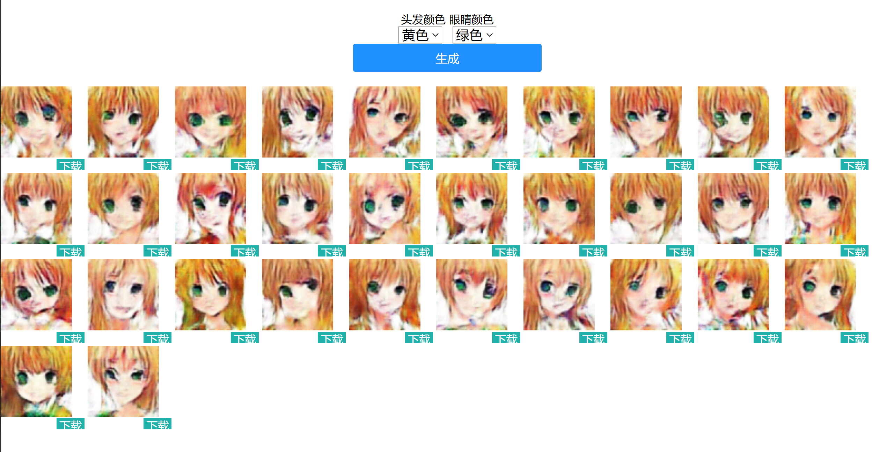

## 运行环境：

- keras：2.3.1
- tensorflow：1.14.0
- flask：1.1.2

## 前置条件

这个代码是[GitHub - xiaohuiduan/cgan_anime_face: use conditional gan to create anime face by keras](https://github.com/xiaohuiduan/cgan_anime_face)的进一步可视化，以网页的形式来展示生成的动漫图片。关于该项目的原理，可以参考[GAN网络之入门教程（五）之基于条件cGAN动漫头像生成](https://www.cnblogs.com/xiaohuiduan/p/13791700.html)，关于更多GAN网络的原理，可以参考[GAN网络入门](https://www.cnblogs.com/xiaohuiduan/category/1799415.html)。

本人并不会前端代码，因此前端页面是我舍友随便帮我弄了弄，然后我自己又随便弄了弄，因此前端代码有点过于难看。emm

## 页面内容

### 首页

首页有两个按钮：随机生成和自定义生成。

- 随机生成：随机生成图片，hair和eye的颜色都是随机的。
- 自定义生成：可以自己选择hair和eye的颜色。

### 随机生成

点击【随机生成】按钮，展示32张图片

### 自定义生成

选择头发的颜色和眼睛的颜色，就可以生成对应的动漫图片。

## 文件结构

- cgan：cgan产生图片的代码以及模型文件

- static：前端资源css和image文件
- templates：html代码
- app.py：flask代码

## 运行方法

运行app.py文件即可，然后打开127.0.0.1:5000即可进入首页。

